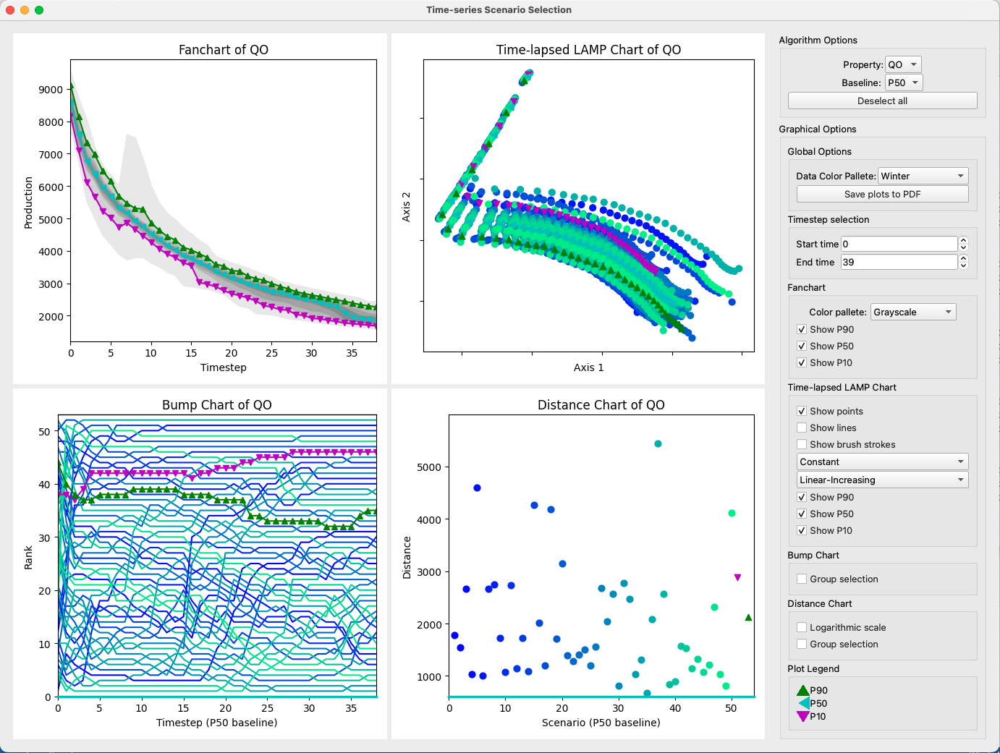

# Visual interactive support for selecting scenarios from time-series ensembles
[Guilherme Schardong [1]](https://schardong.github.io/)
[Ariane Rodrigues[1]](https://scholar.google.com.br/citations?user=aKb1MZYAAAAJ)
[Simone Barbosa [1]](https://www.inf.puc-rio.br/~simone)
[Hélio Lopes [1]](https://www.inf.puc-rio.br/~lopes)
<br>
[1] Departamento de Informática, PUC-Rio

This is the official implementation of "Visual interactive support for selecting scenarios from time-series ensembles", published on Decision Support Systems, Vol. 113, 2018.

## Getting started

**TL-DR**: If you just want to run the code, follow the steps below (assuming a UNIX system). For more details, jump to `Setup and sample run` section.

```{sh}
python -m venv .venv
source .venv/bin/activate
pip install -r requirements.txt
python mainwindow.py --input-path data_50/
```

### Prerequisites
1. [Python venv](https://docs.python.org/3/library/venv.html)
2. [Git](https://git-scm.com/download)
3. [Qt 5](https://doc.qt.io/qt-5/)

### Code organization
Our codebase resides entirely on the repository root. It is divided in three main categories: Plot, Data and Miscellaneous classes/files. We list them below.

#### Plot classes
* `brushableplot.py` - base class for all plots that support connected-views, a.k.a. "Brushing and Linking"
* `distplot.py` -  distance chart class definition. See an example at the bottom right of Fig. 1
* `fanchart.py` - fan chart class definition. See an example at the top left of Fig. 1
* `rankplot.py` - bump chart class definition. See an example at the bottom left of Fig. 1
* `tlplot.py` - time-lapsed LAMP chart class definition. See an example at the top right of Fig. 1

#### Data classes
These are the only domain specific classes contained here. They are mostly related to oil-reservoir data types. Replace them for your use case. You will also need to replace the loading function in `mainwindow.py`.

* `field.py` - information on a field scenario with all wells' types, names, properties, data and meta-information on the scenario itself (an ID, really)
* `fieldensemble.py` - a set of fields with well types and observed data. Allows querying group-data, historic data (not implemented), well type (not implemented)
* `timeseries.py` - class that contains a thin-wrapper for multidimensional time-series data. Should be replaced by `pandas.DataFrames` really

### Miscellaneous
* `mp.py` - dimesionality reduction methods implementation: MDS, LAMP, TL-LAMP
* `mainwindow.py` - main window of the prototype, also it's entry point. Contains a plot widget, menu, and side-bar for interaction
* `plotwidget.py` - plot widget containing all plots. Handles their communication
* `zoompanhandler.py` - zoom+pan interaction handler used in some of our plots
* `zoompantest.py` - test file for the zoom+pan handler

### Setup and sample run
Assuming you have Qt5 installed, this setup is straightforward. Simply create a virtual environment to isolate your Python installation, install the requirements and run the prototype. These steps are shown below, assuming an UNIX-like system with Python `v3.13.1`, [pyenv](https://github.com/pyenv/pyenv), and [pyenv-virtualenv](https://github.com/pyenv/pyenv-virtualenv) installed.

```{sh}
cd $PATH_TO_REPOSITORY_ROOT
pyenv virtualenv 3.13.1 tsvis
pyenv activate tsvis
pip install -r requirements.txt
python mainwindow.py --input-path data_50/
```

If everything works well, you should see the following window:


## Contributing
Any contribution is welcome. If you spot an error or have questions, open issues, or send an e-mail and we will answer as soon as possible.

## Citation
If you find our work useful in your research, consider citing it in your tech report or paper.

```{bibtex}
@article{schardong:2018:dss,
  title = {Visual interactive support for selecting scenarios from time-series ensembles},
  author = {Guilherme G. Schardong and Ariane M.B. Rodrigues and Simone D.J. Barbosa and Hélio Lopes},
  journal = {Decision Support Systems},
  volume = {113},
  pages = {99-107},
  year = {2018},
  issn = {0167-9236},
  doi = {https://doi.org/10.1016/j.dss.2018.08.001},
  url = {https://www.sciencedirect.com/science/article/pii/S0167923618301222},
}
